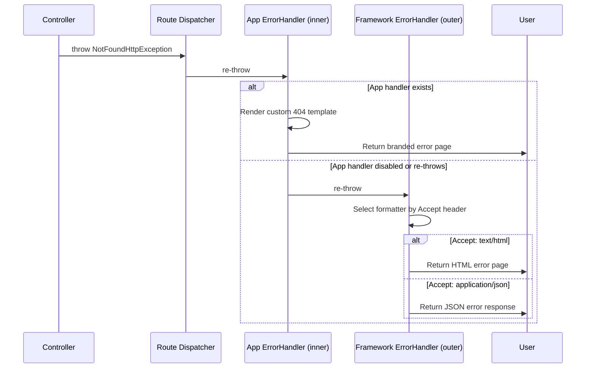

# Error Handling

Error handling is one of the most important — yet often overlooked — parts of building a web application. A well-structured error handling system ensures that:

- **Users** see friendly, helpful pages instead of cryptic error messages
- **Developers** get detailed stack traces during development
- **APIs** return consistent JSON error responses
- **Security** is maintained (no sensitive information leaked in production)

Strux provides a **layered error handling system** that grows with your application — from the built-in framework middleware to custom error templates, HTTP exceptions, and optional Whoops integration for development.

---

## Table of Contents

- [The Error Handling Architecture](#the-error-handling-architecture)
- [How Exceptions Flow Through the Application](#how-exceptions-flow-through-the-application)
- [HTTP Exceptions](#http-exceptions)
- [The Framework Error Handler Middleware](#the-framework-error-handler-middleware)
- [The Application Error Handler Middleware](#the-application-error-handler-middleware)
- [Custom Error Pages (Twig Templates)](#custom-error-pages-twig-templates)
- [Development vs. Production Error Display](#development-vs-production-error-display)
- [Whoops Integration](#whoops-integration)
- [Best Practices](#best-practices)
- [Troubleshooting](#troubleshooting)
- [Related Documentation](#related-documentation)

---

## The Error Handling Architecture

Strux uses a **two-tier middleware approach** for error handling:

```
┌──────────────────────────────────────────────────────────┐
│  Framework ErrorHandlerMiddleware (outer)                 │
│  ┌────────────────────────────────────────────────────┐  │
│  │  Application ErrorHandlerMiddleware (inner)         │  │
│  │  ┌──────────────────────────────────────────────┐  │  │
│  │  │  Other Middleware (CSRF, sessions, auth...)   │  │  │
│  │  │  ┌────────────────────────────────────────┐  │  │  │
│  │  │  │  Route Dispatcher / Controller          │  │  │  │
│  │  │  └────────────────────────────────────────┘  │  │  │
│  │  └──────────────────────────────────────────────┘  │  │
│  └────────────────────────────────────────────────────┘  │
└──────────────────────────────────────────────────────────┘
```

### Why Two Layers?

| Layer | Class | Purpose |
|---|---|---|
| **Framework** (outer) | `Strux\Component\Middleware\ErrorHandlerMiddleware` | General-purpose error catching for all Strux apps. Uses content negotiation (HTML, JSON, plain text) via formatters. Registered automatically. |
| **Application** (inner) | `App\Http\Middleware\ErrorHandlerMiddleware` | Optional, project-specific error handling. Can render custom Twig templates, inject auth data, return branded error pages. Registered manually. |

> [!NOTE]
> Middleware follows a LIFO (Last In, First Out) pattern — the inner middleware is added later and catches exceptions from the route dispatcher and controller FIRST. If the inner middleware handles the exception (returns a response), the outer middleware never sees it. If the inner middleware re-throws, the outer middleware catches it.

### PSR Standards Compliance

Strux's error handling system is built on PHP-FIG **PSR standards**, making it framework-agnostic and interoperable:

| Standard | Role in Error Handling |
|---|---|
| **PSR-7** (HTTP Messages) | Error middleware returns `Psr\Http\Message\ResponseInterface` — the standard HTTP response interface. Responses are fully compatible with any PSR-7 library. |
| **PSR-15** (HTTP Server Request Handlers) | Both the framework and application error middlewares implement `Psr\Http\Server\MiddlewareInterface`, meaning they can be used in any PSR-15 compliant stack. |
| **PSR-3** (Logging Interface) | The framework's `ErrorHandlerMiddleware` accepts a `Psr\Log\LoggerInterface` for logging caught exceptions, supporting Monolog, Log4PHP, or any PSR-3 logger. |

This means you can:

- **Swap** the error middleware with any third-party PSR-15 middleware
- **Reuse** the error middleware in other PSR-15 frameworks
- **Integrate** with any PSR-3 logging library
- **Test** the middleware in isolation using PSR-7 factories

```php
// The framework's error middleware accepts any PSR-3 logger:
use Monolog\Logger;
use Monolog\Handler\StreamHandler;

$logger = new Logger('errors');
$logger->pushHandler(new StreamHandler(__DIR__ . '/../var/logs/errors.log'));

// Pass it to the formatters or your own middleware
```

---

## How Exceptions Flow Through the Application

Let's trace what happens when a controller throws an exception:

### Step-by-Step Flow

```
1. Controller throws NotFoundHttpException
2. Route dispatcher catches nothing — it re-throws
3. Inner middleware (Application ErrorHandler) catches it
   │
   ├─ App handler exists? → Renders custom error template → Returns response
   │
   └─ App handler re-throws? → Outer middleware (Framework ErrorHandler) catches
       │
       ├─ Checks content type (Accept header)
       │   ├─ application/json → JsonFormatter
       │   ├─ text/html → HtmlFormatter
       │   ├─ text/plain → PlainFormatter
       │   └─ */* or none → Default formatter
       │
       └─ Returns formatted error response
```

### Real-World Flow



---

## HTTP Exceptions

Strux provides a complete set of **HTTP-specific exception classes** — one for every standard HTTP error status code. Instead of manually setting status codes in try/catch blocks, you throw the right exception and let the error handling system figure out the rest.

### The HttpExceptionInterface

All HTTP exceptions implement:

```php
namespace Strux\Component\Exceptions\Http;

interface HttpExceptionInterface extends Throwable
{
    public function getStatusCode(): int;
    public function getHeaders(): array;
}
```

This interface is the key to generic error handling. Instead of checking for 15 different exception types, your middleware can check for **one interface** and use `getStatusCode()` to route to the correct template or formatter.

```php
if ($e instanceof HttpExceptionInterface) {
    $status = $e->getStatusCode();
    // Route to the right error template based on $status
}
```

### The Base Class

The abstract `Strux\Component\Exceptions\Http\HttpException` provides the implementation:

```php
class HttpException extends RuntimeException implements HttpExceptionInterface
{
    public function __construct(
        int $statusCode,
        string $message = '',
        ?Throwable $previous = null,
        array $headers = [],
        int $code = 0
    );
}
```

### Complete Exception Reference

| Exception Class | Status Code | Typical Use Case |
|---|---|---|
| `BadRequestHttpException` | 400 | Malformed syntax, invalid input |
| `UnauthorizedHttpException` | 401 | Missing or invalid authentication |
| `AccessDeniedHttpException` | 403 | Authenticated but not permitted |
| `NotFoundHttpException` | 404 | Route or resource not found |
| `HttpMethodNotAllowedException` | 405 | Wrong HTTP method (GET vs POST) |
| `NotAcceptableHttpException` | 406 | Content negotiation failure |
| `ConflictHttpException` | 409 | Duplicate resource, version conflict |
| `GoneHttpException` | 410 | Resource permanently removed |
| `UnprocessableEntityHttpException` | 422 | Validation errors |
| `TooManyRequestsHttpException` | 429 | Rate limiting |
| `ServerErrorHttpException` | 500 | Generic server error |
| `ServiceUnavailableHttpException` | 503 | Maintenance, overload |
| `UnsupportedMediaTypeHttpException` | 415 | Wrong Content-Type |

### Throwing HTTP Exceptions in Controllers

```php
namespace App\Controller;

use Strux\Component\Exceptions\Http\NotFoundHttpException;
use Strux\Component\Exceptions\Http\AccessDeniedHttpException;
use Strux\Component\Exceptions\Http\BadRequestHttpException;

class UserController
{
    public function show(int $id)
    {
        $user = $this->users->find($id);

        if (!$user) {
            throw new NotFoundHttpException(
                "User with ID {$id} was not found."
            );
        }

        return view('users/show', ['user' => $user]);
    }

    public function delete(int $id)
    {
        if (!$this->auth->isAdmin()) {
            throw new AccessDeniedHttpException(
                'Only administrators can delete users.'
            );
        }

        // Proceed with deletion...
    }
}
```

> [!TIP]
> The message you pass to the exception is displayed on your custom error pages (see [Custom Error Pages](#custom-error-pages-twig-templates) below).

### Non-HTTP Exceptions

Strux also includes several framework-level exceptions that don't extend `HttpExceptionInterface` but are still handled by the error system:

| Exception | Default Status | Description |
|---|---|---|
| `RouteNotFoundException` | 404 | No matching route found |
| `HttpMethodNotAllowedException` | 405 | Route exists but wrong method |
| `ValidationException` | 422 | Input validation failed |
| `CSRFMismatchException` | 419 | CSRF token invalid/expired |
| `RouteParameterTypeMismatchException` | 400 | Route parameter type violation |
| `ContainerException` | 400 | DI container resolution error |
| `NotFoundException` (Container) | 400 | Service not registered in container |

> [!NOTE]
> The framework's `AbstractFormatter::determineStatusCode()` checks exceptions in priority order:
> 1. `HttpExceptionInterface` → `$exception->getStatusCode()` (any status, including 3xx, 4xx, 5xx)
> 2. `RouteNotFoundException` → 404
> 3. `HttpMethodNotAllowedException` → 405
> 4. `UnsupportedMediaTypeHttpException` → 415
> 5. `ValidationException` → 422
> 6. `CSRFMismatchException` → 419
> 7. `RouteParameterTypeMismatchException` → 400
> 8. Container exceptions → 400
> 9. Falls back to `$exception->getCode()` if it's between 400-599
> 10. Defaults to 500

---

## The Framework Error Handler Middleware

The framework ships with a general-purpose `ErrorHandlerMiddleware` that handles any uncaught exception via content negotiation.

### Location

```
vendor/strux/strux-framework/src/Component/Middleware/ErrorHandlerMiddleware.php
```

### How It Works

```php
class ErrorHandlerMiddleware implements MiddlewareInterface
{
    public function process(
        ServerRequestInterface $request,
        RequestHandlerInterface $handler
    ): ResponseInterface {
        try {
            return $handler->handle($request);
        } catch (Throwable $e) {
            // 1. Log the exception
            $this->logger->error("Caught Unhandled Throwable: {$e->getMessage()}", $context);

            // 2. Try formatters in order
            foreach ($this->formatters as $formatter) {
                if ($formatter->isValid($request)) {
                    return $formatter->handle($e, $request);
                }
            }

            // 3. Fallback to default formatter
            return $this->defaultFormatter->handle($e, $request);
        }
    }
}
```

### Available Formatters

| Formatter | MIME Type | Output |
|---|---|---|
| `HtmlFormatter` | `text/html` | Full HTML error page with details in debug mode |
| `JsonFormatter` | `application/json` | Structured JSON error response |
| `PlainFormatter` | `text/plain` | Plain text error (useful for CLI) |

The formatter selection is based on the request's `Accept` header. A browser requesting `text/html` gets the `HtmlFormatter`, while an API client requesting `application/json` gets the `JsonFormatter`.

### Debug Mode Behavior

When `debug` is enabled in your configuration (`APP_DEBUG=true`), the `HtmlFormatter` includes:
- The full exception message
- A complete stack trace
- File and line numbers of each frame
- Previous exceptions (chained exceptions)

In production (`APP_DEBUG=false`), only a **generic error message** is shown — no sensitive details are exposed.

---

## The Application Error Handler Middleware

For project-specific error handling — like branded error pages with your auth system — you can create a custom `ErrorHandlerMiddleware` in your application.

> [!NOTE]
> This middleware is **not shipped** with the application skeleton. It's created manually when you need custom error templates.

### Example Implementation

```php
namespace App\Http\Middleware;

use Psr\Container\ContainerInterface;
use Psr\Http\Message\ResponseInterface;
use Psr\Http\Message\ServerRequestInterface;
use Psr\Http\Server\MiddlewareInterface;
use Psr\Http\Server\RequestHandlerInterface;
use Strux\Component\Exceptions\Http\HttpExceptionInterface;
use Strux\Component\Exceptions\RouteNotFoundException;
use Strux\Component\Http\Psr7\Response;
use Strux\Component\View\ViewInterface;

class ErrorHandlerMiddleware implements MiddlewareInterface
{
    public function __construct(
        private ContainerInterface $container
    ) {}

    public function process(
        ServerRequestInterface $request,
        RequestHandlerInterface $handler
    ): ResponseInterface {
        try {
            return $handler->handle($request);
        } catch (\Throwable $e) {
            $viewEngine = $this->container->get(ViewInterface::class);
            $response = new Response();

            // Determine template and data based on exception type
            if ($e instanceof HttpExceptionInterface) {
                $status = $e->getStatusCode();
                // ... route to error/404, error/403, or error/500
            } elseif ($e instanceof RouteNotFoundException) {
                // 404 handling
            } else {
                // 500 fallback
            }

            $content = $viewEngine->render($template, $data);
            $response = $response->withStatus($status);
            $response->getBody()->write($content);
            return $response->withHeader('Content-Type', 'text/html; charset=utf-8');
        }
    }
}
```

### Registering the Custom Middleware

In your application's `MiddlewareRegistry`:

```php
namespace App\Registry;

use App\Http\Middleware\ErrorHandlerMiddleware;
use Psr\Container\ContainerInterface;
use Strux\Bootstrapping\Registry\ServiceRegistry;
use Strux\Foundation\Application;

class MiddlewareRegistry extends ServiceRegistry
{
    public function build(): void
    {
        $this->container->singleton(
            ErrorHandlerMiddleware::class,
            static fn(ContainerInterface $c) => new ErrorHandlerMiddleware($c)
        );
    }

    public function init(Application $app): void
    {
        $app->addMiddleware($this->container->get(ErrorHandlerMiddleware::class));
    }
}
```

> [!IMPORTANT]
> This inner middleware is registered **after** the framework's outer middleware, so it catches exceptions first.

---

## Custom Error Pages (Twig Templates)

When you create a custom `ErrorHandlerMiddleware` in your application, you can render **branded error pages** using Twig templates.

### Template Location

```
templates/errors/
├── 403.html.twig    # Access Denied
├── 404.html.twig    # Not Found
└── 500.html.twig    # Server Error
```

### Example: 404 Template

```twig



<div class="error-container">
    <h1 class="error-code">404</h1>
    <p class="error-message">{{ message }}</p>
    <div class="error-links">
        <a href="/">Return Home</a>
        <a href="/gallery">Browse Gallery</a>
        <a href="/contact">Contact Us</a>
    </div>
</div>

```

### Example: 403 Template with Auth Data

```twig



<div class="error-container">
    <i class="ph ph-lock"></i>
    <h1>Access Denied</h1>
    <p>You are logged in as <strong>{{ displayRole }}</strong>.</p>
    <p>{{ message }}</p>
    <a href="/dashboard">Back to Dashboard</a>
</div>

```

### Passing Data to Error Templates

Your middleware can inject any data the template needs:

```php
$data = [
    'title' => 'Not Found',
    'status' => 404,
    'message' => $e->getMessage() ?: "Sorry, we couldn't find this page.",
];

// For 403 pages, you can include auth info:
if ($status === 403) {
    $data['displayRole'] = $this->getUserDisplayRole();
}

$content = $viewEngine->render('errors/404', $data);
```

---

## Development vs. Production Error Display

One of the most important concepts in error handling is the **development vs. production distinction**.

### Production Mode (`APP_DEBUG=false`)

In production:
- Users see **friendly, branded error pages** (your Twig templates)
- No stack traces or sensitive information are exposed
- Errors are logged to `var/logs/` for developers to review
- API clients receive safe, generic JSON error responses

```env
APP_ENV=production
APP_DEBUG=false
```

### Development Mode (`APP_DEBUG=true`)

In development:
- Developers see **detailed error information** with full stack traces
- File paths and line numbers are clickable (with editor integration)
- Twig template rendering errors are visible
- API requests show structured error details

```env
APP_ENV=development
APP_DEBUG=true
```

### Choosing the Right Strategy

| Environment | Error Display Strategy | Security Level |
|---|---|---|
| Local development | Whoops pretty pages (recommended) or detailed HTML formatter | Low — you're the only user |
| Staging / QA | Custom error pages + error logging | Medium — hide internals from testers |
| Production | Custom error pages + error logging | High — never expose internals to users |

---

## Whoops Integration

[Whoops](https://filp/whoops) is a popular PHP error handling library that provides beautiful, detailed error pages during development. Strux supports Whoops integration with just a few lines of code.

> [!NOTE]
> Whoops is already included as a dependency in the framework. You don't need to install it separately.

### How Whoops Works with Strux's Middleware

In a standard Strux application, the error handling middleware wraps the entire request pipeline in a try/catch block. This means exceptions are **always caught by middleware before they become uncaught exceptions**. 

Since Whoops registers itself as PHP's **global exception handler** (via `set_exception_handler`), it only sees exceptions that **escape** the entire middleware stack. To make Whoops work, you need to:

1. Disable the error handling middlewares in development
2. Register Whoops

### Basic Integration

In your `web/index.php`:

```php
// ... after adding all your middleware and before $app->run()

if ($app->isDevelopment()) {
    // Disable the framework's built-in error middleware
    $app->disableMiddleware(
        \Strux\Component\Middleware\ErrorHandlerMiddleware::class
    );

    // (Optional) if you created a custom error middleware
    // $app->disableMiddleware(
    //     \App\Http\Middleware\ErrorHandlerMiddleware::class
    // );

    // Register Whoops to handle uncaught exceptions
    $whoops = new \Whoops\Run();
    $whoops->pushHandler(new \Whoops\Handler\PrettyPageHandler());
    $whoops->register();
}

$app->run();
```

### Configuring Editor Integration

The `PrettyPageHandler` supports clicking file paths to open them directly in your editor:

```php
$prettyHandler = new \Whoops\Handler\PrettyPageHandler();
$prettyHandler->setEditor('vscode');  // or 'phpstorm', 'sublime', etc.
$whoops->pushHandler($prettyHandler);
```

Supported editors:
- `vscode` — Visual Studio Code
- `phpstorm` — PhpStorm
- `sublime` — Sublime Text
- `atom` — Atom
- `idea` — IntelliJ IDEA
- `netbeans` — NetBeans
- Plus others (see Whoops documentation)

### Adding JSON Support for API Requests

If your application serves API requests, you may want to return JSON errors for AJAX calls:

```php
$jsonHandler = new \Whoops\Handler\JsonResponseHandler();
$jsonHandler->addTraceToOutput(true);
$whoops->pushHandler($jsonHandler);

// Push the pretty handler LAST so it handles non-AJAX requests
$whoops->pushHandler(new \Whoops\Handler\PrettyPageHandler());
```

### Full Whoops Configuration

```php
use Whoops\Run;
use Whoops\Handler\PrettyPageHandler;
use Whoops\Handler\JsonResponseHandler;

if ($app->isDevelopment()) {
    $app->disableMiddleware(
        \Strux\Component\Middleware\ErrorHandlerMiddleware::class
    );

    $whoops = new Run();

    // Pretty page for browser requests
    $prettyHandler = new PrettyPageHandler();
    $prettyHandler->setEditor('vscode');
    $prettyHandler->addResourcePath(__DIR__ . '/../resources/whoops');
    $whoops->pushHandler($prettyHandler);

    // JSON for API requests (checks Accept header)
    $whoops->pushHandler(function ($exception, $inspector, $run) {
        $accept = $_SERVER['HTTP_ACCEPT'] ?? '';
        if (str_contains($accept, 'application/json')) {
            $jsonHandler = new JsonResponseHandler();
            $jsonHandler->addTraceToOutput(true);
            return $jsonHandler->handle();
        }
        return \Whoops\Handler\Handler::DONE;
    });

    $whoops->register();
}
```

---

## The `disableMiddleware()` Method

The `Application` class provides a convenient method to remove middleware from the global stack:

```php
$app->disableMiddleware(string $targetMiddleware): self
```

This method:
1. Iterates through the `$globalMiddleware` array
2. Matches by class name (`get_class()` for objects or direct string comparison)
3. Removes all matching entries
4. Re-indexes the array

```php
// Disable by fully qualified class name string
$app->disableMiddleware(\Strux\Component\Middleware\ErrorHandlerMiddleware::class);
```

> [!NOTE]
> `disableMiddleware()` works with both object instances AND class name strings. If a middleware was added as an object, it matches by `get_class()`. If added as a string, it matches by direct comparison.

---

## Best Practices

### 1. Always Log Errors

Even when you handle errors gracefully, always log them:

```php
catch (Throwable $e) {
    $this->logger->error($e->getMessage(), [
        'exception' => get_class($e),
        'file' => $e->getFile(),
        'line' => $e->getLine(),
        'trace' => $e->getTraceAsString(),
    ]);
    // ... render error page
}
```

### 2. Use Specific HTTP Exceptions

Instead of throwing a generic `HttpException(404)`, throw `NotFoundHttpException`. This makes your code:
- **Self-documenting** — the exception class name tells you what happened
- **Catchable** — you can catch specific types without checking status codes
- **Consistent** — the status code is baked into the class

### 3. Never Expose Internals in Production

```php
// BAD — exposes internal details
$message = $e->getMessage() . ' in ' . $e->getFile() . ':' . $e->getLine();

// GOOD — safe for production
$message = 'An internal error has occurred. Please try again later.';
```

### 4. Create Branded Error Pages

Your error pages should match your application's design. Include:
- Your logo and branding
- Navigation links (Home, Contact, etc.)
- A helpful message, not just "404 Not Found"
- For 403 pages, consider showing the user's role or name

### 5. Handle Errors at the Right Layer

| Layer | Responsibility |
|---|---|
| **Controller** | Business logic validation, domain-specific errors |
| **Route middleware** | Auth failures, CSRF, method validation |
| **Error handler middleware** | Uncaught exceptions, fallback responses |

Don't try to handle every possible error in your controller — let unhandled exceptions bubble up to the error middleware.

### 6. Structure Your Error Templates

Keep your error templates organized:

```
templates/errors/
├── 403.html.twig     # Access denied (auth-aware)
├── 404.html.twig     # Page not found (storefront-style)
├── 500.html.twig     # Server error (with support contact)
└── partials/         # Reusable error components
    ├── error-nav.html.twig
    └── error-footer.html.twig
```

---

## Troubleshooting

### "I see a blank page instead of an error page"

This usually means the exception is happening **before** middleware is registered (during bootstrapping) or **after** the response is sent. Check:
1. PHP error logs (`var/logs/`)
2. The PHP `display_errors` setting in your `php.ini`
3. That your template files exist and are readable
4. That the view engine is properly configured

### "Whoops doesn't show — I still get the framework error page"

The error middlewares are still active and catching the exception before Whoops sees it. Make sure:
1. `$app->isDevelopment()` returns `true` (check `.env` has `APP_DEBUG=true`)
2. `$app->disableMiddleware(...)` is called **before** `$app->run()`
3. You're disabling the correct middleware class name

### "My custom error template is not rendering"

Possible causes:
1. The template file doesn't exist at the path you specified
2. The view engine can't find the template (check `templates/` path configuration)
3. There's a Twig syntax error in your template (check error logs)
4. The data array is missing a variable the template expects

### "404 errors show as 500"

The exception being thrown doesn't match any of your catch conditions and falls through to the generic 500 handler. Check:
1. That you're throwing an `HttpExceptionInterface`-compatible exception
2. That your catch block checks for the right interface or class
3. The order of your `if`/`elseif` checks

### "JSON API requests return HTML error pages"

Your error handling middleware doesn't account for the `Accept` header:
1. Check if the request's `Accept` header includes `application/json`
2. Use content negotiation in your middleware to return different formats
3. Or use the framework's `ErrorHandlerMiddleware` which handles this automatically (it checks `Accept` and routes to the appropriate formatter)

---

## Related Documentation

- [Middleware (PSR-15)](./middleware.mdx) — Understanding middleware in Strux
- [Advanced Middleware Patterns](./middleware-advanced.mdx) — Error handling middleware patterns
- [Request Life Cycle](./lifecycle.mdx) — How requests flow through the application
- [Configuration & Environment](../getting-started/environment.md) — Managing `APP_ENV` and `APP_DEBUG`
- [Twig Templates](../views/twig.md) — Creating view templates with Twig
- [Response](./response.md) — Building HTTP responses
- [Authorization](../security/protecting-routes.md) — Protecting routes and auth errors
- [Dependency Injection](./dependency-injection.mdx) — Injecting services into middleware
- [Service Registries](./registries.md) — Registering middleware in the application

---

## Summary

Strux's error handling system provides:

- **Two-tier middleware** — framework-level (automatic, content-negotiated) and application-level (custom, brand-aware)
- **Full HTTP exception hierarchy** — 14+ exception classes, one for every standard status code
- **Custom error templates** — Twig-based branded error pages with auth integration
- **Whoops integration** — Beautiful development error pages with editor links
- **Production safety** — Sensitive details are hidden in production automatically
- **Content negotiation** — HTML for browsers, JSON for APIs, text for CLI
